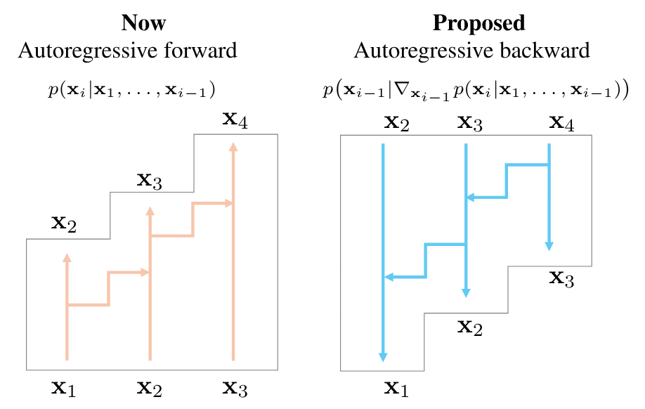

# Inverse Language Modeling for Robust and Grounded LLMs

<p align="center">
    <i>A causal model looks ahead, but only its gradients disclose the pasts that might have built that future.</i>
    <br>
    <a href="https://github.com/davegabe">Davide Gabrielli</a>*
    <a href="https://github.com/simonesestito">Simone Sestito</a>*
    <a href="https://github.com/iacopomasi">Iacopo Masi</a>
    <br>
    *Equal contribution
    <br>
    Sapienza University of Rome
    <br>
    <a href="https://arxiv.org/abs/2510.01929">
        
    </a>
</p>

Welcome to the official GitHub repository for our arXiv Technical Report 2025 paper, “Inverse Language Modeling for Robust and Grounded LLMs”.
This repository contains the implementation of the methods and experiments discussed in the paper, providing all the necessary resources to reproduce our results and explore the techniques we developed.

## About the Project
The current landscape of defensive mechanisms for LLMs is fragmented and underdeveloped, unlike prior work on classifiers.

To further promote adversarial robustness in LLMs, we propose Inverse Language Modeling (ILM), a unified framework that simultaneously:
1) improves the robustness of LLMs to input perturbations, and, at the same time,
2) enables native grounding by inverting model outputs to identify potentially toxic or unsafe input triggers.

ILM transforms LLMs from static generators into analyzable and robust systems, potentially helping RED teaming.

ILM can lay the foundation for next-generation LLMs that are not only robust and grounded but also fundamentally more controllable and trustworthy.

<p align="center">
    
    <br>
    <i>Illustration of Inverse Language Modeling (ILM) setup. Forward pass predicts next tokens, backward pass reconstructs inputs from gradients.</i>
</p>

## Usage
This code provides some `sbatch` scripts to be run on a SLURM cluster, even in offline mode, such as Cineca.
Adaptation is required to be run locally, but the scripts already contain the commands to run. A CUDA GPU is required for efficiency reasons.

For more information and specific cases, feel free to send an email to the repository authors.

## Reference
```bibtex
@misc{gabrielli2025inverselanguagemodelingrobust,
      title={Inverse Language Modeling towards Robust and Grounded LLMs}, 
      author={Davide Gabrielli and Simone Sestito and Iacopo Masi},
      year={2025},
      eprint={2510.01929},
      archivePrefix={arXiv},
      primaryClass={cs.CL},
      url={https://arxiv.org/abs/2510.01929}, 
}
```

